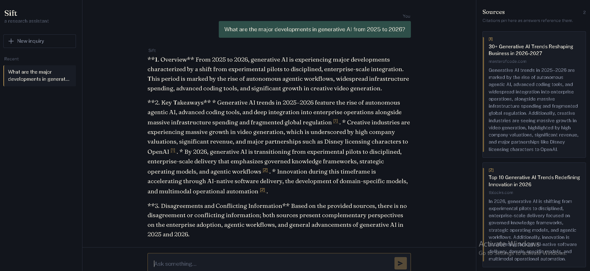

 
 
## Overview

AI Research Assistant is an agentic research system that combines live web search with large language models to automate the research workflow.

The system accepts a research query, retrieves relevant information using the Tavily Search API, processes the retrieved sources, and uses Google Gemini to synthesize the findings into a structured, source-grounded research report.

## Features

* **Web Research** — Retrieves relevant and up-to-date information from the web using Tavily.
* **LLM-Powered Analysis** — Uses Google Gemini to analyze and synthesize retrieved information.
* **Source-Grounded Responses** — Grounds generated findings in retrieved sources to improve factual reliability.
* **Automated Reports** — Generates structured research reports from collected sources.
* **Agentic Workflow** — Coordinates search, source processing, summarization, and final synthesis.
* **FastAPI Backend** — Provides an API layer for running the research pipeline.
* **Web Interface** — Simple browser-based interface for submitting research queries.
* **Dockerized Deployment** — Containerized with Docker for consistent and reproducible execution.

## Architecture

```text
User Query
    ↓
FastAPI
    ↓
Agent Loop
    ↓
Tavily Web Search
    ↓
Relevant Sources
    ↓
Source Summarization
    ↓
Google Gemini
    ↓
Research Synthesis
    ↓
Citation-Grounded Report
```

## Tech Stack

| Technology          | Purpose                                |
| ------------------- | -------------------------------------- |
| Python              | Core application and research pipeline |
| FastAPI             | Backend API                            |
| Google Gemini       | LLM-powered analysis and synthesis     |
| Tavily Search API   | Web search and source retrieval        |
| HTML/CSS/JavaScript | Web interface                          |
| Docker              | Application containerization           |

## Project Structure

```text
AI-research-assistant/
│
├── agent_loop.py
├── basicllm_test.py
├── build_report.py
├── main.py
├── search.py
├── summarize_sources.py
├── index (1).html
├── requirements.txt
├── Dockerfile
├── .dockerignore
├── .gitignore
└── README.md
```

## Setup

### 1. Clone the repository

```bash
git clone https://github.com/mariumzehramehdi-stack/AI-research-assistant.git
cd AI-research-assistant
```

### 2. Create a virtual environment

```bash
python -m venv venv
```

### 3. Activate the environment

**Windows:**

```bash
venv\Scripts\activate
```

**macOS/Linux:**

```bash
source venv/bin/activate
```

### 4. Install dependencies

```bash
pip install -r requirements.txt
```

### 5. Configure environment variables

Create a `.env` file in the project root:

```env
GEMINI_API_KEY=your_gemini_api_key
TAVILY_API_KEY=your_tavily_api_key
```

Never commit API keys or `.env` files to the repository.

### 6. Run locally

```bash
uvicorn main:app --reload
```

The application will be available at:

```text
http://localhost:8000
```

## Docker

The application is containerized using Docker.

### Build the Docker image

```bash
docker build -t ai-research-assistant .
```

### Run the container

```bash
docker run --env-file .env -p 8000:8000 ai-research-assistant
```

The application will then be available at:

```text
http://localhost:8000
```

## Research Workflow

1. User submits a research query.
2. The agent initiates a web search through Tavily.
3. Relevant sources are collected and processed.
4. Source content is summarized.
5. Google Gemini analyzes the retrieved information.
6. The findings are synthesized into a structured report.
7. Retrieved sources are included to support the generated research.

## Use Cases

* Research assistance
* Technical research
* Topic exploration
* Information synthesis
* Source-grounded AI responses
* Automated research reporting

## Security

* API keys are stored in environment variables.
* `.env` is excluded from version control.
* Local cache files are excluded from the Docker build context.
* Secrets should never be hardcoded or committed to the repository.

## Future Improvements

* Add conversation memory
* Improve source ranking and relevance filtering
* Add additional research agents
* Add streaming responses
* Improve report formatting
* Deploy the containerized application to a cloud platform
* Add automated testing and CI/CD

## Author

**Mariam Zehra**
Computer Science Student | AI/ML | Python
 

   
